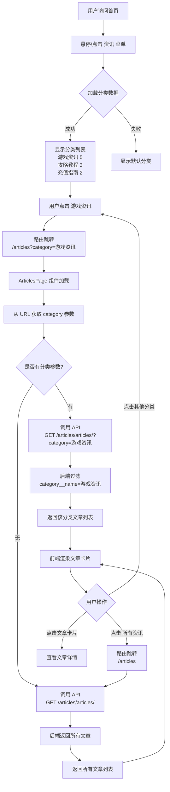

# 文章分类过滤功能 - 可视化流程

## 整体架构图

```
┌──────────────────────────────────────────────────────────────┐
│                        用户界面层                            │
│                                                              │
│  ┌────────────────────────────────────────────────────┐     │
│  │              导航栏 (Layout.vue)                    │     │
│  │                                                    │     │
│  │  首页  游戏▼  资讯▼  客服                          │     │
│  │               │                                    │     │
│  │               └──► 游戏资讯 (5)                    │     │
│  │                    攻略教程 (3)                    │     │
│  │                    充值指南 (2)                    │     │
│  │                    活动公告 (1)                    │     │
│  └────────────────────────────────────────────────────┘     │
│                         │                                    │
│                         │ 点击                               │
│                         ↓                                    │
│  ┌────────────────────────────────────────────────────┐     │
│  │          文章列表页 (ArticlesPage.vue)              │     │
│  │                                                    │     │
│  │  所有资讯 / 游戏资讯                               │     │
│  │                                                    │     │
│  │  ┌──────────┐  ┌──────────┐  ┌──────────┐        │     │
│  │  │ 文章1    │  │ 文章2    │  │ 文章3    │        │     │
│  │  │ 游戏资讯 │  │ 游戏资讯 │  │ 游戏资讯 │        │     │
│  │  └──────────┘  └──────────┘  └──────────┘        │     │
│  └────────────────────────────────────────────────────┘     │
└──────────────────────────────────────────────────────────────┘
                         │
                         │ API 请求
                         ↓
┌──────────────────────────────────────────────────────────────┐
│                        API 层                                │
│                                                              │
│  GET /api/articles/articles/?category=游戏资讯               │
│                                                              │
│  ┌────────────────────────────────────────────────────┐     │
│  │        ArticleViewSet (views.py)                   │     │
│  │                                                    │     │
│  │  def get_queryset(self):                           │     │
│  │      category_name = request.query_params.get(     │     │
│  │          'category', None)                         │     │
│  │      if category_name:                             │     │
│  │          return queryset.filter(                   │     │
│  │              category__name=category_name)         │     │
│  └────────────────────────────────────────────────────┘     │
└──────────────────────────────────────────────────────────────┘
                         │
                         │ ORM 查询
                         ↓
┌──────────────────────────────────────────────────────────────┐
│                     数据库层 (MySQL)                         │
│                                                              │
│  ┌─────────────────────┐      ┌─────────────────────┐       │
│  │  ArticleCategory    │      │      Article        │       │
│  │  ─────────────────  │      │  ─────────────────  │       │
│  │  id: 1              │◄─────│  id: 1              │       │
│  │  name: 游戏资讯     │      │  category_id: 1     │       │
│  │  is_active: True    │      │  title: 游戏新闻... │       │
│  │  articles_count: 5  │      │  status: published  │       │
│  └─────────────────────┘      └─────────────────────┘       │
└──────────────────────────────────────────────────────────────┘
```

## 用户交互流程



## 数据流向图

```
┌─────────────┐         ┌─────────────┐         ┌─────────────┐
│             │         │             │         │             │
│  前端组件   │────────►│   API 层    │────────►│  数据库层   │
│             │ 请求    │             │ 查询    │             │
│  Layout     │         │  articles   │         │  Article    │
│  Articles   │         │  ViewSet    │         │  Category   │
│             │◄────────│             │◄────────│             │
│             │ 响应    │             │ 结果    │             │
└─────────────┘         └─────────────┘         └─────────────┘

详细数据流:

1. Layout.vue 加载时
   ────────────────────────────────────────────
   GET /api/articles/categories/
   ─→ ArticleCategoryViewSet
   ─→ ArticleCategory.objects.filter(is_active=True)
   ←─ [
        {id: 1, name: '游戏资讯', articles_count: 5},
        {id: 2, name: '攻略教程', articles_count: 3},
        ...
      ]

2. 用户点击"游戏资讯"
   ────────────────────────────────────────────
   路由变化: /articles → /articles?category=游戏资讯

3. ArticlesPage.vue 监听到路由变化
   ────────────────────────────────────────────
   route.query.category = "游戏资讯"
   ─→ loadArticles()
   ─→ getArticles({ category: "游戏资讯" })

4. 发送 API 请求
   ────────────────────────────────────────────
   GET /api/articles/articles/?category=游戏资讯
   ─→ ArticleViewSet.get_queryset()
   ─→ category_name = "游戏资讯"
   ─→ Article.objects.filter(
        status='published',
        category__name='游戏资讯'
      )

5. 返回文章列表
   ────────────────────────────────────────────
   ←─ {
        "count": 5,
        "results": [
          {
            "id": 1,
            "title": "游戏新闻标题",
            "category": 1,
            "category_name": "游戏资讯",
            ...
          },
          ...
        ]
      }

6. 前端渲染
   ────────────────────────────────────────────
   articles.value = [...5篇文章]
   currentCategory.value = "游戏资讯"
   ─→ v-for 渲染文章卡片
   ─→ 显示面包屑: "所有资讯 / 游戏资讯"
```

## 代码执行时序图

```
用户          Layout.vue        Router         ArticlesPage.vue      API          Backend
 │                │               │                    │              │              │
 │   悬停资讯菜单  │               │                    │              │              │
 ├───────────────►│               │                    │              │              │
 │                │ GET /categories/                   │              │              │
 │                ├───────────────────────────────────────────────────►│              │
 │                │                                    │              │  查询分类    │
 │                │                                    │              ├─────────────►│
 │                │◄───────────────────────────────────────────────────┤              │
 │                │ [游戏资讯(5), 攻略教程(3), ...]     │              │              │
 │                │               │                    │              │              │
 │  显示分类列表  │               │                    │              │              │
 │◄───────────────│               │                    │              │              │
 │                │               │                    │              │              │
 │  点击"游戏资讯" │               │                    │              │              │
 ├───────────────►│               │                    │              │              │
 │                │ push('/articles?category=游戏资讯') │              │              │
 │                ├──────────────►│                    │              │              │
 │                │               │  route.query.category              │              │
 │                │               │   = "游戏资讯"     │              │              │
 │                │               ├───────────────────►│              │              │
 │                │               │                    │ onMounted()  │              │
 │                │               │                    │ loadArticles()              │
 │                │               │                    │              │              │
 │                │               │    GET /articles/articles/?category=游戏资讯      │
 │                │               │                    ├─────────────►│              │
 │                │               │                    │              │  过滤文章    │
 │                │               │                    │              ├─────────────►│
 │                │               │                    │              │              │
 │                │               │                    │◄─────────────┤              │
 │                │               │                    │ [{文章1}, {文章2}, ...]     │
 │                │               │                    │              │              │
 │                │               │  渲染文章列表      │              │              │
 │◄───────────────────────────────────────────────────│              │              │
 │                │               │                    │              │              │
 │  显示游戏资讯文章               │                    │              │              │
 │                │               │                    │              │              │
 │  点击"攻略教程" │               │                    │              │              │
 ├───────────────►│               │                    │              │              │
 │                │ push('/articles?category=攻略教程') │              │              │
 │                ├──────────────►│                    │              │              │
 │                │               │  watch 触发        │              │              │
 │                │               ├───────────────────►│              │              │
 │                │               │                    │ loadArticles()              │
 │                │               │                    │              │              │
 │                │               │    GET /articles/articles/?category=攻略教程      │
 │                │               │                    ├─────────────►│              │
 │                │               │                    │              │  过滤文章    │
 │                │               │                    │              ├─────────────►│
 │                │               │                    │◄─────────────┤              │
 │                │               │  更新文章列表      │              │              │
 │◄───────────────────────────────────────────────────│              │              │
 │  显示攻略教程文章（无需刷新）   │                    │              │              │
```

## 关键技术点

### 1. Vue Router 查询参数

```javascript
// URL: /articles?category=游戏资讯

// 获取参数
const category = route.query.category  // "游戏资讯"

// 设置参数
router.push({
  path: '/articles',
  query: { category: '游戏资讯' }
})

// 监听参数变化
watch(() => route.query.category, () => {
  // 参数变化时执行
})
```

### 2. Django ORM 跨表查询

```python
# 模型关系
class Article(models.Model):
    category = models.ForeignKey(ArticleCategory)

# 按关联表字段过滤
Article.objects.filter(category__name='游戏资讯')

# SQL 等效
SELECT * FROM article 
INNER JOIN article_category 
ON article.category_id = article_category.id 
WHERE article_category.name = '游戏资讯'
```

### 3. URL 编码处理

```javascript
// 前端编码
const url = `/articles?category=${encodeURIComponent('游戏资讯')}`
// 结果: /articles?category=%E6%B8%B8%E6%88%8F%E8%B5%84%E8%AE%AF

// 浏览器自动解码
route.query.category  // "游戏资讯"

// 后端自动解码
category_name = request.query_params.get('category')  # "游戏资讯"
```

### 4. Vue 响应式更新

```javascript
// 状态定义
const currentCategory = ref<string>('')
const articles = ref<Article[]>([])

// 状态更新
currentCategory.value = "游戏资讯"  // 自动触发模板更新
articles.value = [...]              // 自动触发列表重渲染

// 模板自动响应
<span>{{ currentCategory }}</span>  // 显示 "游戏资讯"
<div v-for="article in articles">  // 自动更新列表
```

## 性能优化点

### 1. 避免不必要的请求

```javascript
// ✅ 好的做法：只在参数变化时请求
watch(() => route.query.category, () => {
  loadArticles()
})

// ❌ 不好的做法：频繁轮询
setInterval(loadArticles, 1000)
```

### 2. 数据库查询优化

```python
# ✅ 好的做法：使用 select_related 减少查询
Article.objects.filter(
    status='published'
).select_related('category', 'game')

# ❌ 不好的做法：N+1 查询
for article in articles:
    print(article.category.name)  # 每篇文章一次查询
```

### 3. 前端缓存（可选）

```javascript
// 简单的内存缓存
const cache = new Map()

const loadArticles = async (category: string) => {
  const cacheKey = category || 'all'
  
  if (cache.has(cacheKey)) {
    articles.value = cache.get(cacheKey)
    return
  }
  
  const data = await getArticles(params)
  cache.set(cacheKey, data)
  articles.value = data
}
```

## 错误处理流程

```
用户操作
  │
  ├──► API 请求
  │      │
  │      ├──► 网络错误
  │      │      └─► try-catch 捕获
  │      │            └─► 显示错误信息
  │      │                 └─► 提供重试按钮
  │      │
  │      ├──► 404 未找到
  │      │      └─► 显示"暂无文章"
  │      │            └─► 提供返回链接
  │      │
  │      └──► 500 服务器错误
  │             └─► 显示错误信息
  │                   └─► 建议联系客服
  │
  └──► 空数据
         └─► 显示友好提示
               └─► 提供查看全部链接
```

## 测试覆盖点

### 功能测试

- ✅ 分类菜单正确显示
- ✅ 文章数量统计正确
- ✅ 点击分类正确跳转
- ✅ URL 参数正确设置
- ✅ 文章列表正确过滤
- ✅ 面包屑导航正确显示
- ✅ 空分类友好提示
- ✅ 分类切换无刷新

### 边界测试

- ✅ 空分类（无文章）
- ✅ 大量文章（分页）
- ✅ 中文分类名称
- ✅ 特殊字符分类名
- ✅ 不存在的分类
- ✅ 网络断开情况

### 性能测试

- ✅ 首次加载速度
- ✅ 切换分类响应速度
- ✅ 大量分类渲染性能
- ✅ 并发请求处理

---

**文档版本**: 1.0  
**创建时间**: 2026-01-29  
**适用项目**: 游戏充值网站 - 文章分类过滤功能
