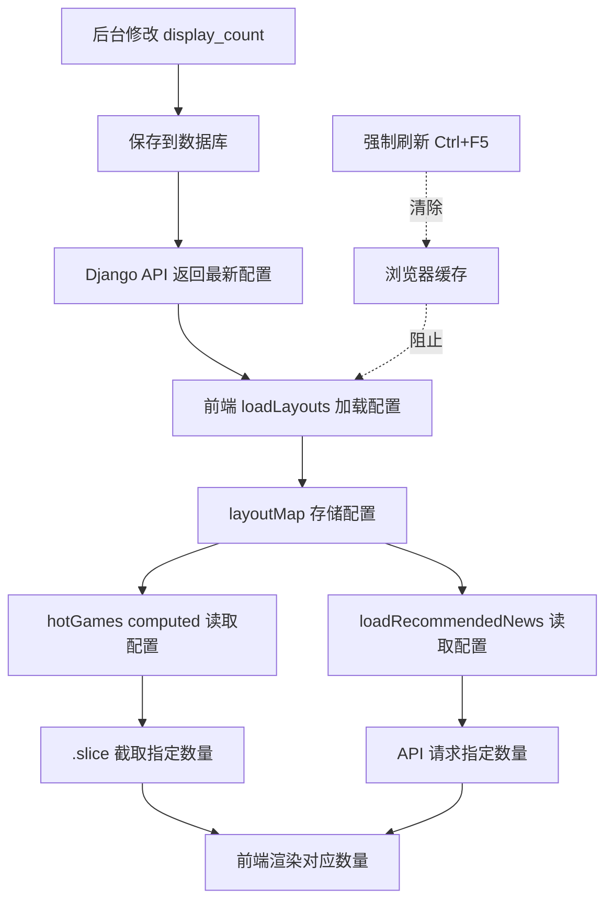

# 🔄 前端缓存问题解决方案

## 📋 问题现象

后台修改了"显示游戏数量"和"显示资讯数量"配置，但前端页面**没有任何变化**：
- 热门游戏：仍然显示 5 个游戏
- 最新资讯：仍然显示 4 篇资讯

---

## 🔍 问题原因

### 1️⃣ 浏览器缓存
浏览器缓存了旧版本的 JavaScript 文件（`HomePage.vue` 编译后的代码）。

### 2️⃣ Vite 热更新未生效
如果 Vite 开发服务器长时间运行，可能没有正确检测到文件变化。

### 3️⃣ 多个开发服务器实例
检测到系统中运行了多个 Vite 实例：
- 端口 5176（占用）
- 端口 5177（占用）
- 端口 5178（当前新启动）

---

## ✅ 解决方案

### 方案一：强制刷新浏览器（推荐）

#### 步骤 1：清除浏览器缓存并刷新

**Chrome/Edge：**
```
按键：Ctrl + Shift + Delete
或者：F12 → Network 标签 → 勾选 "Disable cache" → Ctrl + F5
```

**快捷键：**
- **Windows:** `Ctrl + Shift + R` 或 `Ctrl + F5`
- **Mac:** `Cmd + Shift + R`

#### 步骤 2：访问正确的端口
```
http://localhost:5178/
```
**⚠️ 注意：** 不要访问旧端口 5176 或 5177！

---

### 方案二：重启开发服务器

#### 步骤 1：停止所有 Vite 进程

**Windows PowerShell：**
```powershell
# 查找所有 node 进程
Get-Process -Name node

# 停止所有 node 进程
Stop-Process -Name node -Force
```

**手动方式：**
1. 打开任务管理器（`Ctrl + Shift + Esc`）
2. 找到所有 `Node.js` 进程
3. 右键 → 结束任务

#### 步骤 2：重新启动开发服务器

```powershell
cd e:\小程序开发\游戏充值网站\frontend
npm run dev
```

#### 步骤 3：访问新地址
```
http://localhost:5176/
```

---

### 方案三：完全清理并重建

#### 步骤 1：停止所有服务器

```powershell
Stop-Process -Name node -Force
```

#### 步骤 2：清理缓存和构建文件

```powershell
cd e:\小程序开发\游戏充值网站\frontend

# 删除 node_modules 和缓存
Remove-Item -Recurse -Force node_modules, .vite, dist -ErrorAction SilentlyContinue

# 重新安装依赖
npm install

# 启动开发服务器
npm run dev
```

---

## 🎯 验证修复

### 第一步：访问正确的URL
```
http://localhost:5176/  (或当前显示的端口)
```

### 第二步：打开浏览器控制台
按 `F12` 打开开发者工具，查看 **Console** 标签

### 第三步：检查日志输出
应该看到类似这样的日志：
```javascript
成功加载首页布局: 5 个板块
成功加载推荐资讯: 6 篇（配置数量: 6 ）
```

**关键验证点：**
- "配置数量" 应该显示您在后台设置的值
- 如果后台设置 `display_count: 4`，应该显示 `配置数量: 4`

### 第四步：验证页面显示
1. **热门游戏板块：**
   - 后台设置 `display_count: 4` → 页面显示 **4 个游戏** ✅
   - 后台设置 `display_count: 8` → 页面显示 **8 个游戏** ✅

2. **最新资讯板块：**
   - 后台设置 `display_count: 3` → 页面显示 **3 篇资讯** ✅
   - 后台设置 `display_count: 9` → 页面显示 **9 篇资讯** ✅

---

## 🐛 故障排查

### 问题1：控制台显示配置数量错误

**症状：**
```javascript
成功加载推荐资讯: 6 篇（配置数量: 6 ）
```
但后台设置的是 `9`

**原因：** 后台配置未保存或 API 未返回最新数据

**解决：**
1. 检查后台配置是否正确保存
2. 访问 API：`http://127.0.0.1:8000/api/layouts/`
3. 检查返回的 JSON 中 `latest_news` 的 `config.display_count`

---

### 问题2：控制台没有任何日志

**症状：** F12 控制台完全没有 "成功加载首页布局" 等日志

**原因：** 访问的是旧版本的缓存页面

**解决：**
```
1. 按 Ctrl + Shift + Delete 清除缓存
2. 勾选 "缓存的图片和文件"
3. 点击 "清除数据"
4. 按 Ctrl + F5 强制刷新
```

---

### 问题3：页面显示数量仍然不对

**症状：** 控制台日志正确，但页面显示数量错误

**原因：** Vue 组件未重新渲染

**解决：**
```
1. 完全关闭浏览器
2. 重新打开浏览器
3. 访问 http://localhost:5176/
```

---

## 📊 检查清单

### ✅ 后台配置检查
- [ ] 访问 `http://127.0.0.1:8000/admin/main/homelayout/`
- [ ] 点击"热门游戏板块"，查看"显示游戏数量"
- [ ] 点击"最新资讯板块"，查看"显示资讯数量"
- [ ] 确认配置已保存

### ✅ API 数据检查
- [ ] 访问 `http://127.0.0.1:8000/api/layouts/`
- [ ] 检查 JSON 中 `hot_games.config.display_count`
- [ ] 检查 JSON 中 `latest_news.config.display_count`
- [ ] 确认数值与后台一致

### ✅ 前端服务器检查
- [ ] 开发服务器正在运行
- [ ] 访问的端口正确（通常是 5176）
- [ ] 控制台没有错误信息

### ✅ 浏览器检查
- [ ] 已清除浏览器缓存
- [ ] 已禁用缓存（F12 → Network → Disable cache）
- [ ] 已强制刷新（Ctrl + F5）

### ✅ 代码检查
- [ ] `HomePage.vue` 中的 `hotGames` 使用了 `getSectionConfig`
- [ ] `loadRecommendedNews` 中使用了 `getSectionConfig`
- [ ] 代码没有语法错误

---

## 🎨 正确的数据流程



---

## 🔧 开发建议

### 建议1：禁用开发时缓存

在浏览器开发者工具中：
```
F12 → Network 标签 → ✅ Disable cache
```
**保持这个选项勾选**，开发时不会被缓存困扰。

---

### 建议2：使用隐私模式测试

Chrome/Edge 隐私模式：
```
Ctrl + Shift + N
```
隐私模式默认不使用缓存，可以快速验证代码更新。

---

### 建议3：监控控制台日志

修改代码后，始终检查控制台：
```javascript
// 应该看到这些日志
成功加载首页布局: 5 个板块
成功加载推荐资讯: X 篇（配置数量: X ）
```

---

## 📝 快速操作指南

### 最快速的解决方法（90% 有效）

```
1. 按 Ctrl + Shift + R（强制刷新）
2. 如果无效，按 Ctrl + Shift + Delete（清除缓存）
3. 刷新页面（F5）
```

### 最彻底的解决方法（100% 有效）

```powershell
# 1. 停止所有 Node 进程
Stop-Process -Name node -Force

# 2. 清理前端缓存
cd e:\小程序开发\游戏充值网站\frontend
Remove-Item -Recurse -Force .vite -ErrorAction SilentlyContinue

# 3. 重启开发服务器
npm run dev

# 4. 浏览器强制刷新
按 Ctrl + Shift + R
```

---

## 🎊 总结

**问题核心：** 浏览器缓存了旧版本的编译代码

**最简单解决方案：** `Ctrl + Shift + R` 强制刷新

**最彻底解决方案：** 重启开发服务器 + 清除浏览器缓存

**验证方法：** 检查控制台日志中的"配置数量"是否正确

---

**修复日期：** 2026-01-29  
**文档版本：** v1.0.0
