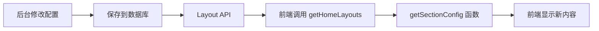

# 🎯 后台配置同步前端网页 - 使用说明

## ✅ 功能已实现

现在您可以在后台管理页面修改板块内容，**前端网页会实时同步显示**！

## 📋 支持配置的板块

### 1️⃣ 热门游戏板块 (`hot_games`)

**后台配置地址：**
```
http://127.0.0.1:8000/admin/main/homelayout/
点击"热门游戏板块"编辑
```

**可配置字段：**
```json
{
  "icon": "🔥",                    // 板块图标（emoji）
  "title": "热门游戏",              // 主标题
  "subtitle": "畅玩热门游戏，超值充值优惠",  // 副标题/描述
  "display_count": 8,               // 显示游戏数量
  "layout": "grid",                 // 布局方式
  "show_game_rating": true,         // 显示游戏评分
  "show_discount": true,            // 显示折扣信息
  "show_more_button": true          // 显示"查看更多"按钮
}
```

**前端显示效果：**
- 📌 **主标题：** 显示 `title` 字段的值（如："热门游戏"）
- 📝 **内容描述：** 显示 `subtitle` 字段的值（如："畅玩热门游戏，超值充值优惠"）
- 🎨 **图标：** 显示 `icon` 字段的 emoji（如："🔥"）

---

### 2️⃣ 核心特性板块 (`features`)

**可配置字段：**
```json
{
  "title": "我们的优势",
  "subtitle": "专业、安全、便捷的游戏充值服务",
  
  "feature_1_icon": "⚡",
  "feature_1_title": "极速到账",
  "feature_1_desc": "自动充值，秒速到账，无需等待",
  
  "feature_2_icon": "🔒",
  "feature_2_title": "安全可靠",
  "feature_2_desc": "官方授权，正规渠道，保障您的账号安全",
  
  "feature_3_icon": "💰",
  "feature_3_title": "超值优惠",
  "feature_3_desc": "多种优惠活动，充值越多优惠越多",
  
  "layout": "horizontal",
  "show_animation": true
}
```

**前端显示：**
- 主标题和副标题
- 3个特性卡片，每个包含图标、标题、描述

---

### 3️⃣ 最新资讯板块 (`latest_news`)

**可配置字段：**
```json
{
  "icon": "📰",
  "title": "最新资讯",
  "subtitle": "智能推荐 · 热门阅读 · 最新发布",
  "display_count": 6,
  "show_category": true,
  "show_author": false,
  "show_date": true,
  "show_thumbnail": true,
  "show_more_button": true,
  "layout": "card"
}
```

**前端显示：**
- 📌 **主标题：** 显示 `title` 字段
- 📝 **副标题：** 显示 `subtitle` 字段
- 🎨 **图标：** 显示 `icon` 字段的 emoji

---

### 4️⃣ 游戏分类板块 (`categories`)

**可配置字段：**
```json
{
  "title": "游戏分类",
  "subtitle": "快速找到您喜欢的游戏类型",
  "show_all_category": true,
  "layout_style": "card",
  "columns": 4,
  "show_game_count": true,
  "show_category_icon": true,
  "enable_hover_effect": true,
  "show_hot_badge": true,
  "display_count": 8,
  "show_more_button": false
}
```

**前端显示：**
- 主标题和副标题

---

## 🎯 使用步骤

### 第一步：访问后台管理

```
http://127.0.0.1:8000/admin/main/homelayout/
```

### 第二步：选择要编辑的板块

例如：点击"热门游戏板块"

### 第三步：修改配置字段

**示例修改：**

**原配置：**
```json
{
  "icon": "🔥",
  "title": "热门游戏",
  "subtitle": "最受欢迎的游戏充值",
  "display_count": 8
}
```

**修改为：**
```json
{
  "icon": "🎮",
  "title": "精选游戏",
  "subtitle": "畅玩热门游戏，超值充值优惠",
  "display_count": 12
}
```

### 第四步：保存

点击"保存"或"保存并继续编辑"

### 第五步：查看前端效果

刷新前端页面：`http://localhost:5176/`

**您会看到：**
- ✅ 主标题变为："精选游戏"（而不是"热门游戏"）
- ✅ 内容描述变为："畅玩热门游戏，超值充值优惠"
- ✅ 图标变为：🎮（而不是🔥）

---

## 📊 配置字段说明

### 通用字段

| 字段名 | 类型 | 说明 | 示例 |
|--------|------|------|------|
| `icon` | String | 板块图标（emoji） | "🔥", "🎮", "📰" |
| `title` | String | 主标题 | "热门游戏", "最新资讯" |
| `subtitle` | String | 副标题/描述 | "畅玩热门游戏..." |

### 热门游戏专属字段

| 字段名 | 类型 | 说明 | 示例 |
|--------|------|------|------|
| `display_count` | Number | 显示游戏数量 | 8, 12, 16 |
| `layout` | String | 布局方式 | "grid", "list", "carousel" |
| `show_game_rating` | Boolean | 显示游戏评分 | true, false |
| `show_discount` | Boolean | 显示折扣信息 | true, false |

### 核心特性专属字段

| 字段名 | 类型 | 说明 | 示例 |
|--------|------|------|------|
| `feature_1_icon` | String | 特性1图标 | "⚡", "🔒" |
| `feature_1_title` | String | 特性1标题 | "极速到账" |
| `feature_1_desc` | String | 特性1描述 | "自动充值，秒速到账..." |

---

## 🔄 实时同步原理



**关键代码：**

**前端获取配置：**
```typescript
// 获取板块配置
const getSectionConfig = (sectionKey: string, configKey: string, defaultValue: any) => {
  return layoutMap.value[sectionKey]?.config?.[configKey] ?? defaultValue
}
```

**模板使用：**
```vue
<h2>
  {{ getSectionConfig('hot_games', 'title', '热门游戏') }}
</h2>
<p>
  {{ getSectionConfig('hot_games', 'subtitle', '最受欢迎的游戏充值') }}
</p>
```

---

## 📝 配置示例

### 示例1：修改热门游戏板块

**场景：**想把"热门游戏"改为"精选推荐"

**操作：**
1. 进入后台 → 热门游戏板块
2. 修改 JSON：
```json
{
  "icon": "⭐",
  "title": "精选推荐",
  "subtitle": "为您精心挑选的优质游戏",
  "display_count": 10,
  "layout": "grid",
  "show_game_rating": true,
  "show_discount": true,
  "show_more_button": true
}
```
3. 保存
4. 刷新前端页面

**结果：**
- 主标题显示："精选推荐"
- 描述显示："为您精心挑选的优质游戏"
- 图标显示：⭐

---

### 示例2：修改核心特性

**场景：**修改第一个特性的内容

**操作：**
1. 进入后台 → 核心特性板块
2. 修改 JSON：
```json
{
  "title": "核心优势",
  "subtitle": "选择我们的理由",
  "feature_1_icon": "🚀",
  "feature_1_title": "闪电充值",
  "feature_1_desc": "1秒到账，快人一步",
  ...
}
```
3. 保存

**结果：**
- 板块标题变为："核心优势"
- 第一个特性标题："闪电充值"
- 第一个特性描述："1秒到账，快人一步"

---

## ✅ 验证配置是否生效

### 方法1：浏览器开发者工具

1. 打开前端页面
2. 按 F12 打开控制台
3. 查看 Console 输出：
```
成功加载首页布局: 5 个板块
```
4. 在 Network 标签查看 API 响应：
```
GET http://localhost:8000/api/layouts/
```
5. 查看返回的 JSON 数据中的 `config` 字段

### 方法2：直接查看页面

- 刷新页面
- 查看对应板块的标题、描述是否变化

---

## ⚠️ 注意事项

### 1. JSON 格式要正确

❌ **错误示例：**
```json
{
  "title": "热门游戏"  // 缺少逗号
  "subtitle": "描述"
}
```

✅ **正确示例：**
```json
{
  "title": "热门游戏",
  "subtitle": "描述"
}
```

### 2. 字段名要准确

- 使用后台表单提供的字段名
- 区分大小写（虽然后端存储时会转换）

### 3. 刷新页面查看效果

- 修改后端配置后，需要刷新前端页面
- 前端会重新调用 API 获取最新配置

### 4. 默认值

如果配置字段为空，前端会使用默认值（通常是翻译文本）

---

## 🎯 常见问题

### Q1：修改后前端没有变化？

**可能原因：**
1. 浏览器缓存，按 Ctrl+F5 强制刷新
2. JSON 格式错误，检查后台配置
3. 字段名拼写错误

**解决方法：**
1. 打开浏览器控制台查看是否有错误
2. 检查 API 响应数据是否正确
3. 验证 JSON 格式是否有效

### Q2：如何恢复默认配置？

**方法：**
1. 进入后台对应板块
2. 清空 JSON 配置或删除特定字段
3. 保存

前端会自动使用默认的翻译文本。

### Q3：能否配置图片？

**当前支持：**
- Emoji 图标（如：🔥、🎮、⚡）

**计划支持：**
- 图片 URL（需要添加 `image` 字段）

---

## 📚 技术实现

### 前端代码

**获取配置函数：**
```typescript
const getSectionConfig = (
  sectionKey: string, 
  configKey: string, 
  defaultValue: any = null
): any => {
  return layoutMap.value[sectionKey]?.config?.[configKey] ?? defaultValue
}
```

**模板使用：**
```vue
<!-- 热门游戏标题 -->
<h2>
  {{ getSectionConfig('hot_games', 'title', $t('hotGames')) }}
</h2>

<!-- 热门游戏副标题 -->
<p>
  {{ getSectionConfig('hot_games', 'subtitle', $t('mostPopularGamesRecharge')) }}
</p>

<!-- 热门游戏图标 -->
<span>
  {{ getSectionConfig('hot_games', 'icon', '🔥') }}
</span>
```

### 后端 API

**接口：** `GET /api/layouts/`

**响应示例：**
```json
[
  {
    "id": 2,
    "sectionKey": "hot_games",
    "sectionName": "热门游戏板块",
    "isEnabled": true,
    "sortOrder": 1,
    "config": {
      "icon": "🔥",
      "title": "热门游戏",
      "subtitle": "畅玩热门游戏，超值充值优惠",
      "display_count": 8,
      "layout": "grid",
      "show_game_rating": true,
      "show_discount": true,
      "show_more_button": true
    },
    "viewCount": 0
  }
]
```

---

## 🎉 总结

**现在您可以：**
- ✅ 在后台修改板块标题
- ✅ 在后台修改板块副标题
- ✅ 在后台修改板块图标
- ✅ 在后台修改其他配置选项
- ✅ 前端实时同步显示

**无需修改前端代码，完全通过后台管理！**

---

**祝您使用愉快！** 🎊

如有问题，请查看：
- 后台管理：http://127.0.0.1:8000/admin/main/homelayout/
- 前端页面：http://localhost:5176/
- API 接口：http://127.0.0.1:8000/api/layouts/
