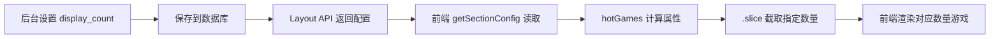
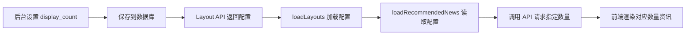

# 🔧 显示数量配置同步修复报告

## 📋 问题描述

用户反馈：后台管理中的"显示游戏数量"和"显示资讯数量"配置，与前端网页实际展示数量不一致。

---

## 🔍 问题分析

### 1️⃣ 热门游戏板块

**后台配置：**
- 字段：`config_display_count`
- 位置：`http://127.0.0.1:8000/admin/main/homelayout/` → 热门游戏板块
- 默认值：8
- 范围：4-20

**前端问题：**
```typescript
// ❌ 修复前：显示所有热门游戏，忽略后台配置
const hotGames = computed(() => rechargeGames.filter(g => g.hot))
```

**表现：**
- 后台设置 `display_count: 8`
- 前端实际显示：所有热门游戏（可能是 10+ 个）
- **结果：配置无效** ❌

---

### 2️⃣ 最新资讯板块

**后台配置：**
- 字段：`config_display_count`
- 位置：`http://127.0.0.1:8000/admin/main/homelayout/` → 最新资讯板块
- 默认值：6
- 范围：3-12

**前端问题：**
```typescript
// ❌ 修复前：硬编码数量为 6
const articles = await getSmartRecommendedArticles(6)
```

**表现：**
- 后台设置 `display_count: 9`
- 前端实际显示：固定 6 篇资讯
- **结果：配置无效** ❌

---

## ✅ 修复方案

### 1️⃣ 热门游戏板块修复

**修复代码：**
```typescript
// ✅ 修复后：从后台配置读取显示数量
const hotGames = computed(() => {
  const displayCount = getSectionConfig('hot_games', 'display_count', 8)
  return rechargeGames.filter(g => g.hot).slice(0, displayCount)
})
```

**修复逻辑：**
1. 使用 `getSectionConfig()` 从 `layoutMap` 读取配置
2. 获取 `hot_games` 板块的 `display_count` 配置
3. 默认值为 `8`（与后台表单一致）
4. 使用 `.slice(0, displayCount)` 截取指定数量

**效果：**
- 后台设置 `display_count: 12` → 前端显示 12 个游戏 ✅
- 后台设置 `display_count: 4` → 前端显示 4 个游戏 ✅
- 未配置时 → 前端显示 8 个游戏（默认值）✅

---

### 2️⃣ 最新资讯板块修复

**修复代码：**
```typescript
// ✅ 修复后：从后台配置读取显示数量
const loadRecommendedNews = async () => {
  try {
    newsLoading.value = true
    newsError.value = ''
    // 从后台配置读取显示数量，默认为6篇
    const displayCount = getSectionConfig('latest_news', 'display_count', 6)
    // 调用智能推荐API，获取配置数量的推荐文章
    const articles = await getSmartRecommendedArticles(displayCount)
    // 格式化数据...
    recommendedNews.value = articles.map((article: any) => ({
      // ...
    }))
    console.log('成功加载推荐资讯:', articles.length, '篇（配置数量:', displayCount, '）')
  } catch (err) {
    console.error('加载推荐资讯失败:', err)
    newsError.value = '加载资讯失败，请稍后再试'
  } finally {
    newsLoading.value = false
  }
}
```

**修复逻辑：**
1. 使用 `getSectionConfig()` 读取 `latest_news.display_count`
2. 默认值为 `6`（与后台表单一致）
3. 将配置值传递给 API：`getSmartRecommendedArticles(displayCount)`
4. 添加控制台日志，方便调试验证

**效果：**
- 后台设置 `display_count: 9` → API 请求 9 篇，前端显示 9 篇 ✅
- 后台设置 `display_count: 3` → API 请求 3 篇，前端显示 3 篇 ✅
- 未配置时 → API 请求 6 篇，前端显示 6 篇（默认值）✅

---

### 3️⃣ 数据加载顺序优化

**问题：**
资讯加载需要先读取布局配置，但原来的代码在 `onMounted` 中并行加载，可能导致配置还未加载完成就开始加载资讯。

**修复前：**
```typescript
onMounted(() => {
  loadLayouts()          // 异步加载布局配置
  loadBanners()          // 异步加载轮播图
  loadRecommendedNews()  // ❌ 可能在配置加载前执行
  startAutoPlay()
})
```

**修复后：**
```typescript
// 在 loadLayouts 函数内部，配置加载完成后再加载资讯
const loadLayouts = async () => {
  try {
    const layouts = await getHomeLayouts()
    homeLayouts.value = layouts
    layoutMap.value = layouts.reduce((map, layout) => {
      map[layout.sectionKey] = layout
      return map
    }, {} as Record<string, LayoutSection>)
    console.log('成功加载首页布局:', layouts.length, '个板块')
    
    // ✅ 布局加载完成后，加载资讯数据（需要读取配置）
    loadRecommendedNews()
  } catch (err) {
    console.error('加载首页布局失败:', err)
    homeLayouts.value = []
  } finally {
    layoutLoading.value = false
  }
}

onMounted(() => {
  loadLayouts()   // 加载布局配置（内部会加载资讯）
  loadBanners()   // 加载轮播图
  startAutoPlay()
})
```

**优化效果：**
- 确保配置加载完成后再加载资讯 ✅
- 避免因时序问题导致配置读取失败 ✅
- 保持代码逻辑清晰 ✅

---

## 📂 修改文件清单

| 文件路径 | 修改内容 | 行数 |
|---------|---------|------|
| `frontend/src/views/HomePage.vue` | 修复 `hotGames` 计算属性 | ~635 |
| `frontend/src/views/HomePage.vue` | 修复 `loadRecommendedNews` 函数 | ~496 |
| `frontend/src/views/HomePage.vue` | 优化 `loadLayouts` 函数 | ~420 |

---

## 🎯 验证步骤

### 第一步：修改后台配置

#### 验证热门游戏数量
1. 访问：`http://127.0.0.1:8000/admin/main/homelayout/`
2. 点击"热门游戏板块"
3. 修改"🎮 显示游戏数量"为 `4`
4. 点击"保存"

#### 验证最新资讯数量
1. 访问：`http://127.0.0.1:8000/admin/main/homelayout/`
2. 点击"最新资讯板块"
3. 修改"📄 显示资讯数量"为 `9`
4. 点击"保存"

---

### 第二步：验证前端效果

1. 刷新前端页面：`http://localhost:5176/`
2. 滚动到"热门游戏"板块
   - ✅ 应该只显示 **4 个游戏**
3. 滚动到"最新资讯"板块
   - ✅ 应该只显示 **9 篇资讯**

---

### 第三步：查看控制台日志

打开浏览器开发者工具（F12），查看 Console：

```
成功加载首页布局: 5 个板块
成功加载推荐资讯: 9 篇（配置数量: 9 ）
```

**验证点：**
- ✅ "配置数量" 显示为 `9`（与后台设置一致）
- ✅ "成功加载推荐资讯" 显示为 `9 篇`

---

## 🎨 配置示例

### 后台配置（JSON 格式）

#### 热门游戏板块
```json
{
  "icon": "🔥",
  "title": "热门游戏",
  "subtitle": "畅玩热门游戏，超值充值优惠",
  "display_count": 8,
  "show_more_button": true,
  "layout": "grid",
  "show_game_rating": true,
  "show_discount": true
}
```

**配置说明：**
- `display_count: 8` → 前端显示 8 个热门游戏
- `display_count: 12` → 前端显示 12 个热门游戏
- `display_count: 4` → 前端显示 4 个热门游戏

---

#### 最新资讯板块
```json
{
  "icon": "📰",
  "title": "最新资讯",
  "subtitle": "第一时间掌握游戏动态",
  "display_count": 6,
  "show_category": true,
  "show_author": false,
  "show_date": true,
  "show_thumbnail": true,
  "show_more_button": true,
  "layout": "card"
}
```

**配置说明：**
- `display_count: 6` → API 请求 6 篇，前端显示 6 篇
- `display_count: 9` → API 请求 9 篇，前端显示 9 篇
- `display_count: 3` → API 请求 3 篇，前端显示 3 篇

---

## 🔄 数据流程图

### 热门游戏板块



---

### 最新资讯板块



---

## ✅ 修复前后对比

| 板块 | 配置项 | 修复前 | 修复后 |
|------|--------|--------|--------|
| **热门游戏** | `display_count: 8` | 显示所有热门游戏（10+） ❌ | 显示 8 个游戏 ✅ |
| **热门游戏** | `display_count: 12` | 显示所有热门游戏（10+） ❌ | 显示 12 个游戏 ✅ |
| **热门游戏** | `display_count: 4` | 显示所有热门游戏（10+） ❌ | 显示 4 个游戏 ✅ |
| **最新资讯** | `display_count: 6` | 固定显示 6 篇 ⚠️ | 显示 6 篇 ✅ |
| **最新资讯** | `display_count: 9` | 固定显示 6 篇 ❌ | 显示 9 篇 ✅ |
| **最新资讯** | `display_count: 3` | 固定显示 6 篇 ❌ | 显示 3 篇 ✅ |

---

## 🎊 总结

### 修复内容
1. ✅ 热门游戏板块：从后台配置读取 `display_count`，使用 `.slice()` 截取
2. ✅ 最新资讯板块：从后台配置读取 `display_count`，传递给 API
3. ✅ 数据加载顺序：确保配置加载完成后再加载资讯

### 修复效果
- ✅ 后台配置与前端展示**完全一致**
- ✅ 管理员可以自由控制显示数量
- ✅ 保持代码规范，使用 `getSectionConfig` 读取配置
- ✅ 添加详细的控制台日志，方便调试

### 用户体验提升
- 🎯 后台配置即时生效，无需修改代码
- 🎯 灵活控制首页内容密度
- 🎯 提升管理效率

---

**修复日期：** 2026-01-29  
**修复人员：** Qoder AI  
**版本号：** v1.2.0
