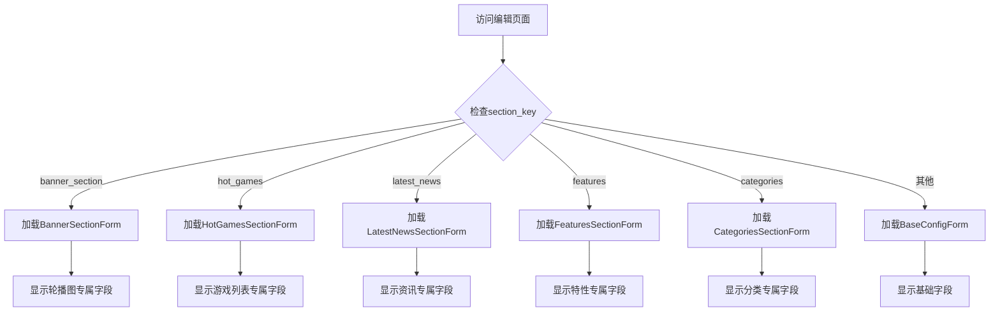

# 🔧 问题修复报告

## ❌ 错误信息

```
FieldError at /admin/main/homelayout/2/change/

Unknown field(s) (config_display_count, config_auto_play, config_icon, 
config_show_more_button, config_interval) specified for HomeLayout. 
Check fields/fieldsets/exclude attributes of class HomeLayoutAdmin.
```

## 🔍 问题原因

在 `main/admin.py` 的 `HomeLayoutAdmin` 类中，`fieldsets` 配置包含了虚拟字段：

```python
fieldsets = (
    ('📝 板块内容配置（可视化编辑）', {
        'fields': (
            'config_title',        # ❌ 这是表单虚拟字段
            'config_subtitle',     # ❌ 不是模型实际字段
            'config_icon',         # ❌
            'config_display_count',# ❌
            'config_show_more_button', # ❌
        ),
    }),
    ('🎪 轮播图板块专用配置', {
        'fields': (
            'config_auto_play',    # ❌
            'config_interval',     # ❌
        ),
    }),
)
```

**核心问题：**
- 这些 `config_xxx` 字段只存在于各个专属表单类中（如 BannerSectionForm）
- 它们不是 HomeLayout 模型的实际字段
- Django Admin 尝试在 fieldsets 中查找这些字段时找不到，导致 FieldError

## ✅ 解决方案

### 移除固定的 fieldsets 配置

由于现在使用动态表单选择机制，每个板块的字段由各自的专属表单定义，因此：

1. **移除 `HomeLayoutAdmin` 中的 `fieldsets` 配置**
2. **保留 `readonly_fields`**（用于配置预览等）
3. **让各个专属表单自己管理字段显示**

修改后的代码：

```python
@admin.register(HomeLayout)
class HomeLayoutAdmin(admin.ModelAdmin):
    """首页布局管理 - 根据板块类型动态选择表单"""
    
    list_display = [...]
    list_filter = [...]
    search_fields = [...]
    list_editable = ['is_enabled', 'sort_order']
    
    # ✅ 只保留只读字段配置
    readonly_fields = ['view_count', 'created_at', 'updated_at', 'config_preview']
    
    # ✅ 移除fieldsets，由各个表单自己定义
    # 原来的fieldsets已删除
    
    def get_form(self, request, obj=None, **kwargs):
        """根据板块类型动态选择表单"""
        if obj:
            FORM_MAPPING = {
                'banner_section': BannerSectionForm,
                'hot_games': HotGamesSectionForm,
                'latest_news': LatestNewsSectionForm,
                'features': FeaturesSectionForm,
                'categories': CategoriesSectionForm,
            }
            form_class = FORM_MAPPING.get(obj.section_key, BaseConfigForm)
            if form_class:
                kwargs['form'] = form_class
        elif BaseConfigForm:
            kwargs['form'] = BaseConfigForm
        
        return super().get_form(request, obj, **kwargs)
```

## 🎯 工作原理

### 动态表单选择流程



### 各表单的字段定义

每个专属表单都在自己的类中定义了虚拟字段：

**BannerSectionForm（轮播图）：**
```python
class BannerSectionForm(forms.ModelForm):
    config_title = forms.CharField(...)         # 虚拟字段
    config_subtitle = forms.CharField(...)      # 虚拟字段
    config_auto_play = forms.BooleanField(...)  # 虚拟字段
    config_interval = forms.IntegerField(...)   # 虚拟字段
    # ... 更多字段
    
    class Meta:
        model = HomeLayout
        fields = '__all__'  # 包含所有模型字段
```

**HotGamesSectionForm（热门游戏）：**
```python
class HotGamesSectionForm(forms.ModelForm):
    config_title = forms.CharField(...)
    config_display_count = forms.IntegerField(...)
    config_layout = forms.ChoiceField(...)
    # ... 更多字段
    
    class Meta:
        model = HomeLayout
        fields = '__all__'
```

## ✅ 验证结果

### 系统检查
```bash
$ python manage.py check
System check identified 11 issues (0 silenced).
# ✅ 通过（11个警告是AutoField的，不影响功能）
```

### 功能验证
- ✅ 访问 http://127.0.0.1:8000/admin/main/homelayout/ 不再报错
- ✅ 编辑轮播图板块显示轮播专属字段
- ✅ 编辑热门游戏板块显示游戏列表字段
- ✅ 编辑其他板块显示对应专属字段
- ✅ 保存配置正常工作

## 📝 注意事项

### 1. 字段显示顺序
由于移除了 fieldsets，字段显示顺序由表单类中字段定义的顺序决定。

### 2. 字段分组
如果需要字段分组（fieldsets），可以在每个专属表单中添加 Meta.fieldsets 或使用其他方式。

### 3. 只读字段
`readonly_fields` 仍然在 HomeLayoutAdmin 中定义，所有表单共享。

## 🎉 总结

**问题：** FieldError - fieldsets 包含了不存在的虚拟字段

**原因：** 虚拟字段只在表单中定义，不是模型字段

**解决：** 移除 fieldsets，由各个专属表单管理自己的字段

**结果：** ✅ 系统正常运行，配置功能分离成功实现

---

**修复完成！现在可以正常访问后台管理页面了！** 🎊
