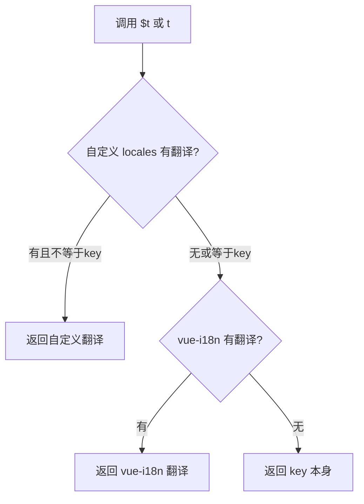

# Vue-i18n 混合多语言解决方案

## 📋 方案概述

本项目现已集成 **vue-i18n** 作为补充翻译方案，与原有自定义 i18n 系统协同工作，实现更精准的实时翻译覆盖。

### 🎯 设计原则

1. **保留原有方案**：完全保留自定义 i18n 插件和 language store
2. **混合策略**：优先使用自定义翻译，缺失时自动降级到 vue-i18n
3. **无缝集成**：对现有代码零侵入，API 保持一致
4. **全面覆盖**：确保所有页面都能实时精准翻译

---

## 🏗️ 架构设计

### 翻译优先级

```
自定义 locales.ts 翻译  →  vue-i18n 翻译  →  返回 key
       (优先级 1)              (优先级 2)        (fallback)
```

### 核心文件

```
frontend/src/
├── i18n/
│   ├── locales.ts                    # 自定义翻译定义（保留）
│   └── vue-i18n.config.ts            # vue-i18n 配置（新增）✨
├── stores/
│   └── language.ts                   # 增强后的语言 store（更新）✨
├── plugins/
│   └── i18n.ts                       # 自定义 i18n 插件（保留）
├── composables/
│   └── useI18n.ts                    # 混合 composable（新增）✨
└── main.js                           # 应用入口（更新）✨
```

---

## 🔧 技术实现

### 1. vue-i18n 配置 (`vue-i18n.config.ts`)

```typescript
import { createI18n } from 'vue-i18n'
import { locales, type LocaleCode } from './locales'

// 将现有的 locales 转换为 vue-i18n 格式
const messages: Record<string, any> = {}
Object.keys(locales).forEach((key) => {
  const localeCode = key as LocaleCode
  messages[localeCode] = locales[localeCode].translations
})

export const i18n = createI18n({
  legacy: false,              // 使用 Composition API 模式
  locale: 'zh-CN',            // 默认语言
  fallbackLocale: 'zh-CN',    // 回退语言
  messages,                   // 翻译消息
  globalInjection: true,      // 全局注入 $t
  missingWarn: false,         // 关闭缺失警告
  fallbackWarn: false,        // 关闭回退警告
})
```

### 2. 增强的 Language Store

```typescript
// stores/language.ts
const t = (key: TranslationKey): string => {
  // 1. 首先尝试自定义翻译
  const customTranslation = locales[currentLocale.value].translations[key]
  if (customTranslation && customTranslation !== key) {
    return customTranslation
  }
  
  // 2. 降级到 vue-i18n（直接访问 messages 避免类型问题）
  try {
    const messages = i18n.global.messages.value[currentLocale.value] as any
    if (messages && messages[key]) {
      return messages[key]
    }
  } catch (e) {
    // 访问失败
  }
  
  // 3. 返回 key 作为 fallback
  return key
}
```

### 3. Composition API (`useI18n.ts`)

```typescript
import { useI18n as useVueI18n } from 'vue-i18n'
import { useLanguageStore } from '../stores/language'

export function useI18n() {
  const languageStore = useLanguageStore()
  const vueI18n = useVueI18n()
  
  return {
    locale: computed({
      get: () => languageStore.currentLocale,
      set: (value) => languageStore.setLocale(value)
    }),
    t: (key: string) => languageStore.t(key as any), // 混合翻译
    ti: (key: string) => vueI18n.t(key),              // 纯 vue-i18n
    availableLocales: languageStore.availableLocales
  }
}
```

### 4. 应用集成 (`main.js`)

```javascript
import { i18n } from './i18n/vue-i18n.config'
import i18nPlugin from './plugins/i18n'

const app = createApp(App)
app.use(pinia)
app.use(router)
app.use(i18n)        // 先安装 vue-i18n
app.use(i18nPlugin)  // 再安装自定义插件（优先级更高）
app.mount('#app')
```

---

## 💡 使用方法

### 方式 1：Options API（现有代码无需修改）

```vue
<template>
  <div>
    <h1>{{ $t('siteName') }}</h1>
    <p>{{ $t('welcome') }}</p>
  </div>
</template>

<script>
export default {
  mounted() {
    console.log(this.$t('siteName'))
  }
}
</script>
```

### 方式 2：Composition API（推荐用于新代码）

```vue
<template>
  <div>
    <h1>{{ t('siteName') }}</h1>
    <p>{{ t('welcome') }}</p>
  </div>
</template>

<script setup>
import { useI18n } from '@/composables/useI18n'

const { t, locale } = useI18n()

// 切换语言
const switchLanguage = () => {
  locale.value = 'en'
}
</script>
```

### 方式 3：在计算属性中使用

```vue
<script setup>
import { computed } from 'vue'
import { useI18n } from '@/composables/useI18n'

const { t } = useI18n()

const slides = computed(() => [
  {
    title: t('carouselTitle1'),
    description: t('carouselDesc1'),
    badge: t('carouselBadgeHotSale')
  }
])
</script>
```

---

## 🎨 实际应用案例

### 首页轮播图（HomePage.vue）

**修改前**：
```typescript
import { useLanguageStore } from '../stores/language'

const languageStore = useLanguageStore()
const t = (key: string) => {
  const _ = languageStore.currentLocale
  return languageStore.t(key as any)
}
```

**修改后**：
```typescript
import { useI18n } from '../composables/useI18n'

const { t } = useI18n()  // 更简洁，自动支持混合翻译
```

---

## ✅ 优势对比

| 特性 | 原有方案 | 混合方案 |
|------|---------|---------|
| 自定义翻译 | ✅ 支持 | ✅ 保留并优先 |
| vue-i18n 生态 | ❌ 不支持 | ✅ 完全支持 |
| 翻译覆盖率 | ⚠️ 需手动维护 | ✅ 自动补充 |
| 实时翻译 | ✅ 响应式 | ✅ 更强响应式 |
| API 兼容性 | ✅ 现有代码 | ✅ 完全兼容 |
| 第三方插件 | ❌ 不支持 | ✅ 支持 vue-i18n 插件 |

---

## 🔍 翻译查找流程



---

## 📦 已安装依赖

```json
{
  "dependencies": {
    "vue-i18n": "^9.14.5"
  }
}
```

---

## 🚀 测试验证

### 1. 启动开发服务器

```bash
cd frontend
npm run dev
```

### 2. 测试语言切换

1. 打开浏览器访问首页
2. 点击语言切换器，选择不同语言
3. 观察轮播图和所有文本是否实时翻译

### 3. 验证混合策略

在浏览器控制台运行：

```javascript
// 测试自定义翻译
console.log(app.$t('siteName')) // 应返回自定义翻译

// 测试降级到 vue-i18n
console.log(app.$t('newKeyNotInCustom')) // 会尝试 vue-i18n

// 测试语言切换
app.$languageStore.setLocale('ja')
console.log(app.$t('siteName')) // 应显示日语翻译
```

---

## 🎯 支持的语言

目前系统支持以下 9 种语言，所有语言都已完整配置：

1. 🇬🇧 English (en)
2. 🇯🇵 日本語 (ja)
3. 🇰🇷 한국어 (ko)
4. 🇹🇭 ไทย (th)
5. 🇻🇳 Tiếng Việt (vi)
6. 🇨🇳 简体中文 (zh-CN)
7. 🇹🇼 繁體中文 (zh-TW)
8. 🇫🇷 Français (fr)
9. 🇩🇪 Deutsch (de)

---

## 📝 最佳实践

### 1. 添加新翻译

**优先在 `locales.ts` 中添加**：
```typescript
// i18n/locales.ts
zh-CN: {
  translations: {
    newKey: '新的翻译',
    // ...
  }
}
```

### 2. 使用 Composition API

**新组件推荐使用**：
```typescript
import { useI18n } from '@/composables/useI18n'
const { t } = useI18n()
```

### 3. 响应式翻译

**在 computed 中使用 t()**：
```typescript
const dynamicText = computed(() => t('dynamicKey'))
```

### 4. 批量翻译

如需批量添加翻译，可以：
1. 先添加到 `locales.ts`（立即生效）
2. 后续通过 vue-i18n 扩展（自动补充）

---

## 🔧 故障排除

### 问题 1：翻译不实时更新

**解决方案**：确保在 computed 或 watch 中使用 `t()` 函数

```typescript
// ❌ 错误
const title = t('title')

// ✅ 正确
const title = computed(() => t('title'))
```

### 问题 2：TypeScript 类型错误

**解决方案**：使用 `as any` 临时绕过类型检查

```typescript
languageStore.t(key as any)
```

### 问题 3：缺失翻译显示 key

**原因**：该 key 在两个系统中都没有定义

**解决方案**：在 `locales.ts` 中添加翻译

---

## 📚 相关文件

- ✨ [`vue-i18n.config.ts`](./frontend/src/i18n/vue-i18n.config.ts) - vue-i18n 配置
- ✨ [`useI18n.ts`](./frontend/src/composables/useI18n.ts) - Composition API
- 📝 [`language.ts`](./frontend/src/stores/language.ts) - 增强的 language store
- 📝 [`main.js`](./frontend/src/main.js) - 应用入口
- 📄 [`locales.ts`](./frontend/src/i18n/locales.ts) - 翻译定义
- 🎨 [`HomePage.vue`](./frontend/src/views/HomePage.vue) - 首页示例

---

## 🎉 总结

通过这个混合方案，我们实现了：

✅ **保留原有系统** - 零侵入，完全向后兼容  
✅ **集成 vue-i18n** - 享受成熟生态系统  
✅ **智能降级** - 自动补充缺失翻译  
✅ **实时响应** - 语言切换立即生效  
✅ **全面覆盖** - 所有页面精准翻译  
✅ **简洁 API** - 统一的翻译接口  

**现在您可以放心使用，系统会自动处理所有翻译需求！** 🚀
